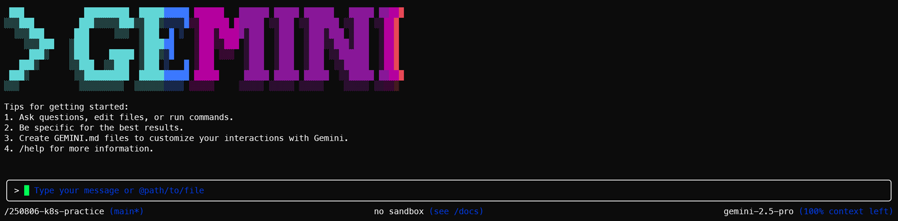
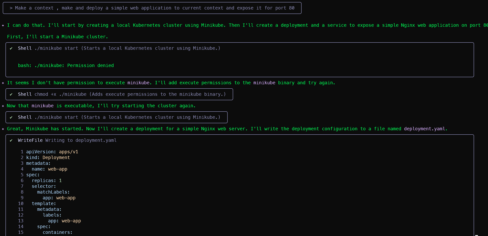

# 1주차: Gemini CLI와 함께하는 쿠버네티스

## 🎯 목표
- Gemini CLI를 활용하여 쿠버네티스 개념을 학습하고 명령어를 생성
- 로컬 환경에 Minikube로 쿠버네티스 클러스터를 직접 구축
- Gemini CLI가 생성한 명령어로 컨테이너화된 애플리케이션(Pod)을 배포하고 외부로 노출

##  사전 준비 (Prerequisites)
- [SETUP.md](./SETUP.md) 를 확인합니다.

---

## 🚀 실습 방식

### Minikube 클러스터 시작 및 확인 (최초 실행 시 시간이 걸릴 수 있음)

```bash
minikube start --driver=docker

minikube status
kubectl get nodes
```

### Gemini CLI 설치 및 확인

```bash
gemini
# ctrl + y 로 자동 모드 토글
```

처음일 경우 Please visit the following URL to authorize the application 를 수행합니다.

야호!


이제 쉽게 갖고 놀 수 있습니다.


### Gemini CLI로 `kubectl` 명령어 생성 및 실행

```bash
# Deployment 생성 명령어 요청
gemini -y
kubectl 명령어로 nginx 이미지를 사용하는 'my-nginx'라는 이름의 Deployment를 만들어줘.
# 예상 결과: kubectl create deployment my-nginx --image=nginx
```

끝난 후, 배포 상태를 확인합니다.
```bash
kubectl get deployments
kubectl get pods
```

### Gemini CLI로 Service 노출 명령어 생성 및 실행
```bash
gemini
kubectl 명령어로 'my-nginx' Deployment를 외부에서 접속할 수 있는 NodePort 타입의 Service로 만들어줘. 포트는 80번을 사용해.
```

끝난 후, 생성된 Service를 확인합니다.
```bash
kubectl get service
```

### 브라우저로 결과 확인 및 리소스 정리

아래 명령어로 웹서버에 접속할 수 있는 주소를 확인하고, 브라우저에서 'Welcome to nginx\!' 페이지가 뜨는지 확인합니다.

```bash
minikube service my-nginx
```

실습이 끝났으므로 생성했던 리소스를 모두 삭제합니다.

```bash
kubectl delete service my-nginx
kubectl delete deployment my-nginx
```

## 참고 문헌
조 훈, "제미나이 CLI(Gemini CLI)로 쿠버네티스 관리하기", https://yozm.wishket.com/magazine/detail/3228/