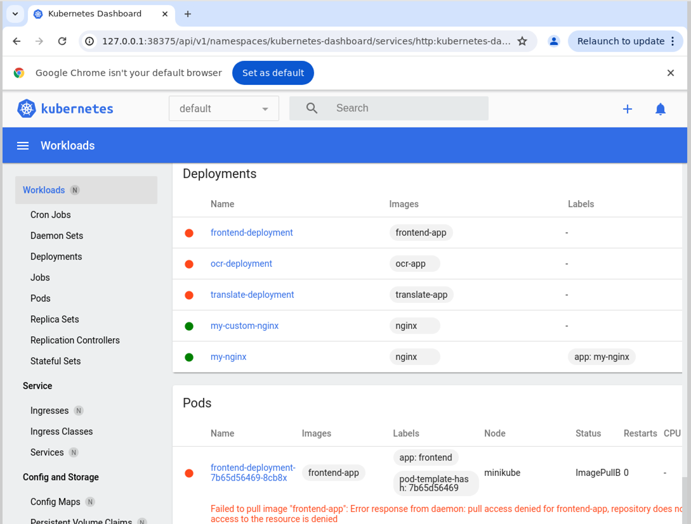

# 2주차: 쿠버네티스로 AI 번역 파이프라인 만들기 (Mock-up 실습) + 자동 복구

## 🎯 최종 목표
  - **Frontend**, **OCR-Worker**, **Translate-Worker** 라는 3개의 마이크로서비스를 컨테이너로 만듭니다.
  - 다중 노드 클러스터 환경 위에, 각 서비스를 쿠버네티스 `Deployment`로 배포하고, `Service`를 통해 서로 통신하게 합니다.
  - 쿠버네티스 스케줄러가 이 서비스의 Pod들을 여러 노드에 자동으로 분산하는 것을 확인합니다.
  - 사용자가 웹 브라우저에서 '번역 요청' 버튼을 누르면, 이 3개의 서비스가 연쇄적으로 작동하여 최종 결과를 보여주는 것을 체험합니다.
  - 의도적으로 노드 하나에 장애를 일으켜, 쿠버네티스가 앱을 **자동으로 복구(Self-Healing)**하는 과정을 관찰합니다.
  - **쿠버네티스 대시보드**를 이용해 이 모든 과정을 시각적으로 확인합니다.


## ⚙️ 사전 준비

  - [이전 실습](../week-1/README.md)에서 사용한 `minikube`, `docker`, `kubectl`
  - Python 3 및 `pip`

-----

### **1단계: 아키텍처 이해하기**

우리는 이미지 편지 번역 시스템 작업을 흉내 내는(mock) 간단한 웹 서비스 3개를 만들 것입니다.

  - **Frontend**: 사용자에게 버튼이 있는 웹 페이지를 보여주고, 최종 번역 결과를 출력합니다.
  - **OCR-Worker**: `Frontend`로부터 요청을 받으면, 5초간 기다린 뒤(OCR 작업 시뮬레이션), 가짜 텍스트("Hello from your child")를 반환합니다.
  - **Translate-Worker**: `OCR-Worker`로부터 텍스트를 받으면, 3초간 기다린 뒤(번역 작업 시뮬레이션), 가짜 번역문("자녀로부터 온 편지입니다. 안녕하세요.")을 반환합니다.

사용자가 `Frontend`의 버튼을 누르면, 내부적으로 `Frontend → OCR-Worker → Translate-Worker` 순서로 연쇄적인 요청이 일어나고, 최종 결과가 다시 `Frontend`로 돌아와 화면에 표시됩니다.

-----

### **2단계: 다중 노드 클러스터 구축**
이번 실습에서는 여러 노드에 Pod를 분산하고 장애를 시뮬레이션해야 하므로, 3개의 노드를 가진 클러스터를 생성합니다.

```bash
# 'pipeline-cluster'라는 이름으로 3개의 노드를 가진 클러스터 시작
minikube start --nodes 3 -p pipeline-cluster

# 클러스터의 노드 목록과 상태 확인
kubectl get nodes
```

-----

### **3단계: Mock-up 앱 준비하기**

이를 위한 `example` 폴더는 아래와 같이 구현되어 있습니다.
```
example/
├── app-frontend.py
├── app-ocr.py
├── app-translate.py
├── requirements.txt
├── Dockerfile
└── pipeline-k8s.yaml
```

-----

### **4단계: 앱을 컨테이너로 빌드하고 클러스터에 로드하기**

각 앱을 Docker 이미지로 빌드합니다. 쿠버네티스는 Docker Hub 같은 원격 저장소나 로컬 Docker의 이미지를 직접 쓸 수 없습니다. 따라서 `minikube`가 쓸 수 있도록 이미지를 로드해주는 과정이 필수입니다. 우리는, 이미 생성한 다중 노드 클러스터(pipeline-cluster)가 이미지를 사용할 수 있도록 합니다.


```bash
for appname in frontend ocr translate; do
  # Dockerfile에 맞게끔 파일 이름 app.py로 변경
  cp example/app-${appname}.py example/app.py
  docker build -t ${appname}-app example
  ## 클러스터를 지정하지 않으면, 기본 클러스터(minikube)에 로드됩니다.
  ## minikube image load ${appname}-app
  # -p 옵션으로 정확한 클러스터를 지정해주는 것이 중요
  minikube -p pipeline-cluster image load ${appname}-app

done

rm example/app.py
```

-----

### **5단계: 쿠버네티스에 파이프라인 배포하기**

[pipeline-k8s.yaml](example/pipeline-k8s.yaml) 파일에는 3개의 `Deployment`와 3개의 `Service`가 모두 정의되어 있습니다. 이제 이 설계도를 쿠버네티스에 적용합니다.

```bash
kubectl apply -f example/pipeline-k8s.yaml
```

-----

### **6단계: 배포 현황 확인 (Orchestration 관찰)**

#### ****가. 대시보드로 전체 구조 확인****

먼저, 대시보드를 열어 우리 시스템이 어떻게 배포되었는지 눈으로 확인합니다.

```bash
minikube -p pipeline-cluster dashboard
```



대시보드에서 `Deployments`, `Pods`, `Services` 메뉴를 눌러보세요.

`Running` 이 아닐 시, Deployments의 실패한 배포를 클릭하면 쿠버네티스 에러 메시지를 확인할 수 있습니다.

Gemini CLI에 에러 메시지를 건네면, 문제의 원인 진단과 코드 수정을 제안해줍니다. 첨부된 스크린샷 [gemini1](./assets/gemini-solve-error-1.png), [gemini2](./assets/gemini-solve-error-2.png)와 [gemini3](./assets/gemini-solve-error-3.png)에서는, Dockerfile을 수정하고 이미지를 다시 빌드하는 작업을 자동으로 수행해 주겠다고 제안합니다.

하지만 Gemini의 이 제안은 **반은 맞고 반은 틀렸습니다.** 😒

-   **Gemini의 진단**: Gemini는 `Dockerfile`의 `CMD`가 `app.py`를 실행하도록 되어 있는데, 실제로는 `app-frontend.py` 같은 파일만 존재한다고 추론했습니다. 이는 우리가 실습을 위해 파일명을 계속 변경했기 때문에 발생한 현상입니다. Gemini는 이 불일치가 이미지 빌드 실패의 원인이라고 판단했습니다.
-   **실제 문제 원인**: 진짜 문제는 Dockerfile의 내용이 아니라, 로컬에서 빌드한 컨테이너 이미지를 `minikube` 클러스터 내부로 로드(`minikube image load ...`)하는 과정을 누락했기 때문입니다. 즉, 쿠버네티스가 **이미지를 찾을 수 없어** 발생한 에러였습니다.

Gemini가 시스템의 전체 맥락(우리가 터미널에서 어떤 작업을 했는지 등)을 모두 알지는 못하므로, **제안된 해결책이 정말 타당한지는 반드시 사용자가 직접 검토하고 판단**해야 합니다.

#### **나. Pod 자동 분산(Scheduling) 확인**

이제 쿠버네티스 스케줄러가 어떻게 Pod들을 여러 노드에 "알아서 잘" 분배했는지 확인합니다. `-o wide` 옵션이 핵심입니다.

```bash
# Pod 목록을 상세 정보(특히 NODE)와 함께 확인
kubectl get pods -o wide
```

결과를 보면 `frontend`, `ocr`, `translate` Pod들이 `pipeline-cluster-m02`, `pipeline-cluster-m03` 두 워커 노드에 골고루 분산되어 있는 것을 볼 수 있습니다. 이것이 바로 쿠버네티스의 자동 스케줄링 기능입니다.

#### **다. 애플리케이션 실제 동작 확인**

분산 배포된 앱이 정상적으로 작동하는지 확인해 봅시다. `Frontend` 서비스를 브라우저로 열어주세요.

```bash
minikube -p pipeline-cluster service frontend-service
```

웹 페이지에서 **"샘플 편지 번역 요청하기"** 버튼을 눌러 약 8초 후 번역 결과가 성공적으로 나타나는지 확인합니다.

-----

### **7단계: 장애 복구(Self-Healing) 시뮬레이션**

이제 이 시스템의 진짜 힘을 확인할 시간입니다. 워커 노드 중 하나를 의도적으로 망가뜨렸을 때, 쿠버네티스가 서비스 중단 없이 어떻게 스스로를 복구하는지 지켜봅니다.

#### **가. 노드 장애 유발**

워커 노드 중 하나(`pipeline-cluster-m02`)를 강제로 중지시킵니다.

```bash
docker stop pipeline-cluster-m02
```

#### **나. 상태 변화 관찰 (5분 가량 소요)**

잠시 후 `kubectl get nodes` 명령어로 노드 상태를 확인하면, 중지시킨 노드가 `NotReady` 상태로 표시됩니다.

이제 진짜 마법이 펼쳐집니다. 약 5분간 기다렸다가 Pod들의 상태를 다시 확인하세요.

```bash
# -w 옵션을 사용하면 변화를 실시간으로 볼 수 있습니다.
kubectl get pods -o wide
```

**죽은 노드(`pipeline-cluster-m02`) 위에서 실행되던 우리의 앱 Pod들이 `Terminating` 상태로 바뀌고, 거의 즉시 살아있는 다른 노드(`pipeline-cluster-m03` 혹은 `pipeline-cluster`) 위로 새로운 Pod들이 `Pending` 또는 `ContainerCreating` 상태로 나타나 결국 `Running` 상태가 되는 것을 볼 수 있습니다.**

YAML에 선언한 "원하는 상태"(e.g., OCR Pod는 2개, 어떤 Pod는 1개 등을 요구)를 유지하기 위해, 쿠버네티스가 스스로 문제를 감지하고 조치한 것입니다. 이것이 쿠버네티스의 **Self-Healing** 입니다.

> Q. 왜 조금 기다려야 하나요?
> 
> A. 쿠버네티스의 장애 복구는 즉각적으로 일어나지 않고, 의도적으로 약간의 지연 시간을 갖도록 설계되어 있습니다. 노드와의 통신이 잠시 끊길 때마다(e.g., 잠깐의 네트워크 불량, 재부팅 등) 옮긴다면, 불필요한 작업이 너무 많이 발생하여 오히려 시스템 전체가 불안정해질 수 있기 때문입니다.

-----

### **8단계: 정리**

실습이 끝났으면 생성했던 모든 리소스를 삭제합니다.

```bash
# YAML 파일에 정의된 모든 리소스 삭제
kubectl delete -f example/pipeline-k8s.yaml

# 다중 노드 클러스터 전체 삭제
## 만약 삭제가 아니라 단순히 중지시키고 싶다면 delete 대신 stop 사용
minikube -p pipeline-cluster delete
```